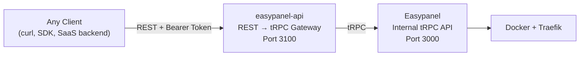

# easypanel-api — Public REST API for Easypanel

> **Standalone, open-source REST API gateway that wraps Easypanel's internal tRPC endpoints into documented, public REST endpoints with OpenAPI specs.**

## Architecture

Runs on the **same VPS** as Easypanel. Translates REST calls to tRPC.

## Endpoint Map

### Projects

| Method | Endpoint | tRPC |
|--------|----------|------|
| GET | `/api/v1/projects` | `projects.list` |
| POST | `/api/v1/projects` | `projects.create` |
| GET | `/api/v1/projects/:name` | `projects.get` |
| DELETE | `/api/v1/projects/:name` | `projects.destroy` |

### Services

| Method | Endpoint | tRPC |
|--------|----------|------|
| GET | `/api/v1/projects/:name/services` | `services.list` |
| POST | `/api/v1/projects/:name/services` | `services.create` |
| GET | `/api/v1/projects/:name/services/:svc` | `services.get` |
| DELETE | `/api/v1/projects/:name/services/:svc` | `services.destroy` |
| POST | `/api/v1/projects/:name/services/:svc/deploy` | `services.deploy` |
| POST | `/api/v1/projects/:name/services/:svc/stop` | `services.stop` |
| PUT | `/api/v1/projects/:name/services/:svc/env` | `services.updateEnv` |
| PUT | `/api/v1/projects/:name/services/:svc/domains` | `services.updateDomains` |
| PUT | `/api/v1/projects/:name/services/:svc/resources` | `services.updateResources` |

### Templates

| Method | Endpoint | tRPC |
|--------|----------|------|
| GET | `/api/v1/templates` | `templates.list` |
| POST | `/api/v1/projects/:name/templates` | `templates.createFromSchema` |

### Compose

| Method | Endpoint | tRPC |
|--------|----------|------|
| POST | `/api/v1/projects/:name/compose` | *compose-specific tRPC* |

## Service Types

All types supported by Easypanel:
`app` · `mysql` · `mariadb` · `postgres` · `mongo` · `redis` · `box` · `compose` · `wordpress`

Each type has its own schema passed in the `POST /services` body.

## Auth

- **Token:** Generated from Easypanel UI (Settings → API Tokens)
- **Header:** `Authorization: Bearer <token>`
- Gateway validates token against Easypanel on each request

## Tech Stack

| Component | Choice |
|-----------|--------|
| Runtime | Node.js + Hono |
| Docs | OpenAPI 3.1 (auto-generated via `@hono/zod-openapi`) |
| Validation | Zod schemas |
| License | MIT |
| Deployment | Same VPS as Easypanel, port 3100 |

## Implementation Steps

1. **Explore** — Clone `easypanel-sdk`, sniff all tRPC endpoints from Easypanel's network tab
2. **Scaffold** — Create `easypanel-api` repo with Hono + `@hono/zod-openapi`
3. **Core routes** — Projects CRUD, Services CRUD, Deploy/Stop
4. **Templates & Compose** — Template schema deployment, compose deployment
5. **Domains & Env** — Domain management, environment variable management
6. **OpenAPI docs** — Swagger UI at `/docs`
7. **Test** — End-to-end tests against a live Easypanel instance
8. **Open-source** — README, LICENSE, publish
